# Name Mapping Rules Guide

[日本語版はこちら](./name_mapping_guide.md)

This document explains the "Name Mapping Rules" feature for bridging GameObject name differences during copy operations.

## Table of Contents

1. [Feature Overview](#feature-overview)
2. [Usage Examples](#usage-examples)
3. [Rule Types](#rule-types)
4. [Humanoid Bone Mapping](#humanoid-bone-mapping)
5. [Processing Flow](#processing-flow)

---

## Feature Overview

> [!NOTE]
> **About bone naming conventions**
> - `J_Bip_*` is the bone naming convention used by **VRoid Studio** during export
> - `mixamorig:*` is the naming convention used in **Adobe mixamo** rigs

The Name Mapping Rules feature allows components to be correctly copied even when source and destination GameObjects have different names.

### Background

Avatars exported from different tools or formats may have different bone names:


### Solution

Use Name Mapping Rules to bridge these naming differences:


---

## Usage Examples

### Example 1: VRM Avatar to FBX Avatar Copy

Copying components from a VRoid Studio format avatar (`J_Bip_*` bones) to a standard FBX format avatar:

```mermaid
graph TB
    subgraph "Source: VRM Avatar"
        direction TB
        S1["Root"]
        S2["J_Bip_C_Hips"]
        S3["J_Bip_C_Spine"]
        S4["J_Bip_C_Chest"]
        S5["J_Bip_C_Head<br>📦 DynamicBone"]
        S1 --> S2 --> S3 --> S4 --> S5
    end
    
    subgraph "Destination: FBX Avatar"
        direction TB
        D1["Armature"]
        D2["Hips"]
        D3["Spine"]
        D4["Chest"]
        D5["Head<br>✅ DynamicBone"]
        D1 --> D2 --> D3 --> D4 --> D5
    end
    
    S5 -.->|"HumanoidBone Rule<br>(Head)"| D5
```



### Example 2: Regex Rule Transformation

```
Find pattern: J_Bip_C_(.+)
Replace pattern: $1
```

| Source | Transformed | Destination | Result |
|--------|-------------|-------------|--------|
| J_Bip_C_Head | Head | Head | ✅ Match |
| J_Bip_C_Spine | Spine | Spine | ✅ Match |
| J_Bip_L_Hand | L_Hand | LeftHand | ❌ No match |

> [!TIP]
> If regex rules alone aren't sufficient, combine them with HumanoidBone rules.

### Example 3: Mixed Rules (Humanoid + Regex)

Example of copying hierarchies containing non-Humanoid bones (Skirt, Hair, accessories, etc.):

```mermaid
graph TB
    subgraph "Source"
        direction TB
        S1["Root"]
        S2["J_Bip_C_Hips<br>📦 PhysicsBone"]
        S3["Skirt<br>📦 DynamicBone"]
        S4["Hair_Front<br>📦 SpringBone"]
        S1 --> S2 --> S3
        S1 --> S4
    end
    
    subgraph "Destination"
        direction TB
        D1["Armature"]
        D2["mixamo:Hips"]
        D3["Skirt"]
        D4["HairFront"]
        D1 --> D2 --> D3
        D1 --> D4
    end
```



**Rule Configuration:**
1. HumanoidBone rule (All)
2. Regex rule: `Hair_(.+)` → `Hair$1`

**Matching Results:**

| Source | Destination | Match Method | Result |
|--------|-------------|--------------|--------|
| J_Bip_C_Hips | mixamo:Hips | HumanoidBone (both Hips) | ✅ Match |
| Skirt | Skirt | **Exact match** | ✅ Match |
| Hair_Front | HairFront | Regex (Hair_Front → HairFront) | ✅ Match |

> [!IMPORTANT]
> **Processing Order**
> 1. **Exact match** (highest priority): Immediate match if names are identical
> 2. **Regex rules**: Transform name and check for match
> 3. **HumanoidBone rules**: Check if mapped to same HumanBodyBones
> 
> This means non-Humanoid bones like Skirt automatically match if names are identical.

---

## Rule Types

### Regex Rules

Transform names using arbitrary regex patterns.


**Configuration Examples:**

| Find Pattern | Replace Pattern | Use Case |
|--------------|-----------------|----------|
| `J_Bip_C_(.+)` | `$1` | Remove VRM center bone prefix |
| `J_Bip_L_(.+)` | `Left$1` | Convert VRM left bones to standard format |
| `J_Bip_R_(.+)` | `Right$1` | Convert VRM right bones to standard format |
| `mixamorig:(.+)` | `$1` | Remove mixamo prefix |

### HumanoidBone Rules

Match using Unity Humanoid rig mapping information.

```mermaid
flowchart TD
    A["Source<br>J_Bip_C_Head"] --> B["Get HumanBodyBones.Head<br>from Animator"]
    C["Destination<br>Head"] --> D["Get HumanBodyBones.Head<br>from Animator"]
    B --> E{"Same HumanBodyBones?"}
    D --> E
    E -->|"Yes"| F["✅ Match"]
    E -->|"No"| G["❌ No match"]
```



> [!IMPORTANT]
> Both source and destination must be configured as **Humanoid rigs**.
> A warning dialog appears for non-Humanoid configurations.

**How Dynamic Mapping Works:**

1. On Copy button press, bone mapping is retrieved from source Animator
2. On Paste button press, bone mapping is retrieved from destination Animator
3. Bones mapped to the same `HumanBodyBones` are matched

This allows matching between VRoid Studio format (`J_Bip_*`), mixamo format (`mixamorig:*`), standard FBX format, etc., as long as Unity's Humanoid retargeting is correctly configured.

---

## Humanoid Bone Mapping

### Bone Groups


### Bone Groups and Included Bones

Specifying a bone group limits matching to the `HumanBodyBones` in that group.

| Group | Included HumanBodyBones |
|-------|-------------------------|
| Head | Head, LeftEye, RightEye, Jaw |
| Neck | Neck |
| Chest | Chest, UpperChest |
| Spine | Spine |
| Hips | Hips |
| Left Arm | LeftShoulder, LeftUpperArm, LeftLowerArm, LeftHand |
| Right Arm | RightShoulder, RightUpperArm, RightLowerArm, RightHand |
| Left Leg | LeftUpperLeg, LeftLowerLeg, LeftFoot, LeftToes |
| Right Leg | RightUpperLeg, RightLowerLeg, RightFoot, RightToes |
| Left Fingers | All left hand finger bones |
| Right Fingers | All right hand finger bones |

---

## Processing Flow

### Name Matching Order

```mermaid
flowchart TD
    START["Start Name Matching"] --> A{"Exact match?"}
    A -->|"Match"| SUCCESS["✅ Match Success"]
    A -->|"No match"| B["Evaluate rules in order"]
    
    B --> C{"Regex rule?"}
    C -->|"Yes"| D["Transform name"]
    D --> E{"Transformed name<br>matches?"}
    E -->|"Yes"| SUCCESS
    E -->|"No"| F["Next rule"]
    
    C -->|"No"| G{"HumanoidBone<br>rule?"}
    G -->|"Yes"| H["Check if same<br>HumanBodyBones via mapping"]
    H -->|"Match"| SUCCESS
    H -->|"No match"| F
    
    F --> I{"More rules<br>remaining?"}
    I -->|"Yes"| C
    I -->|"No"| FAIL["❌ Match Failed"]
```



### Usage in CopyComponentsByRegex


---

## Related Files

| File | Description |
|------|-------------|
| [ReplacementRule.cs](../Editor/ReplacementRule.cs) | Rule data structures |
| [NameMatcher.cs](../Editor/NameMatcher.cs) | Name matching logic |
| [CopyComponentsByRegexWindow.cs](../Editor/CopyComponentsByRegexWindow.cs) | Editor UI |
| [ComponentCopier.cs](../Editor/ComponentCopier.cs) | Copy logic |
