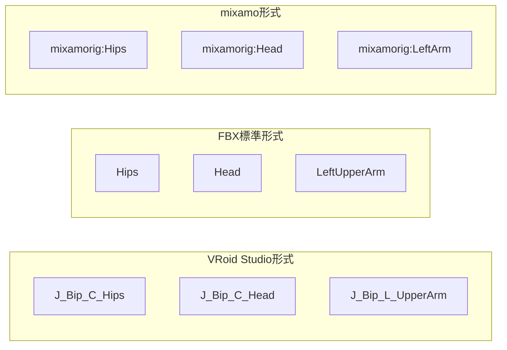
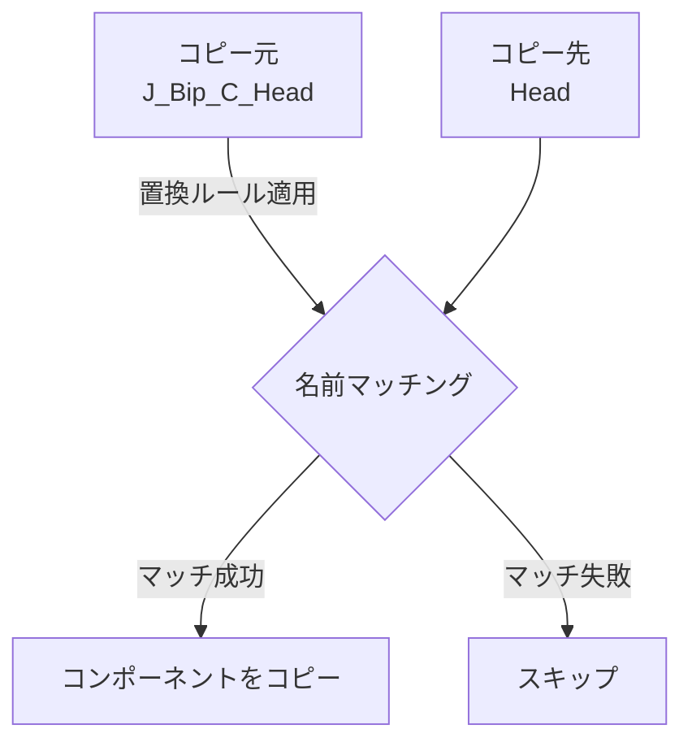
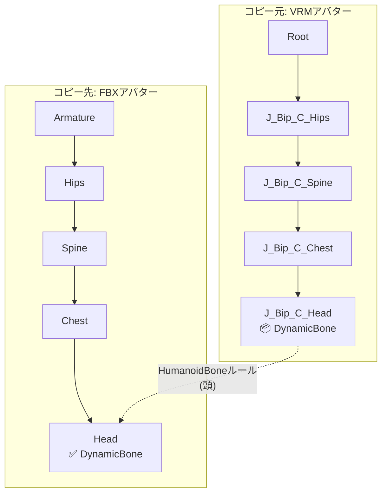
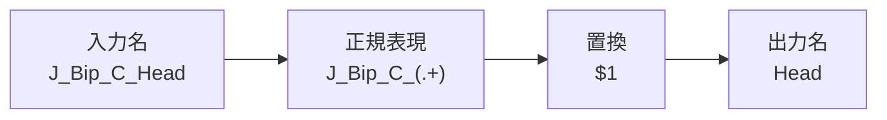
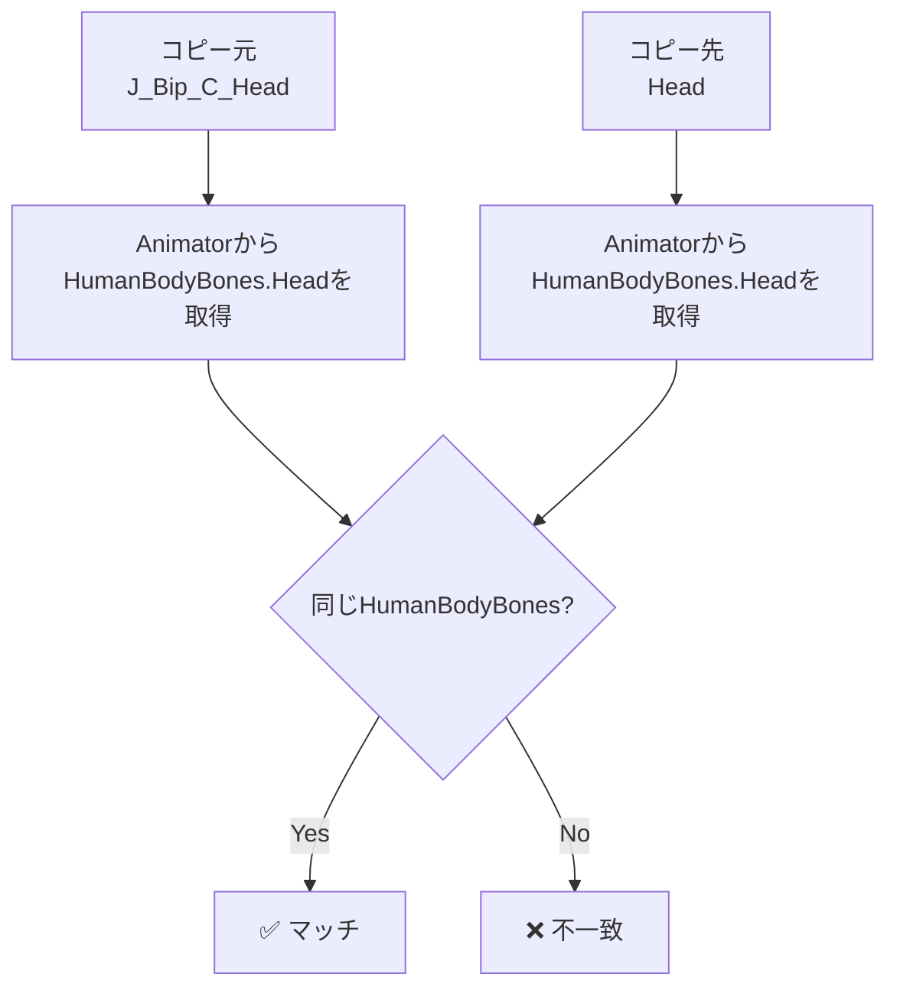
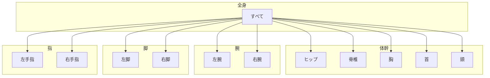
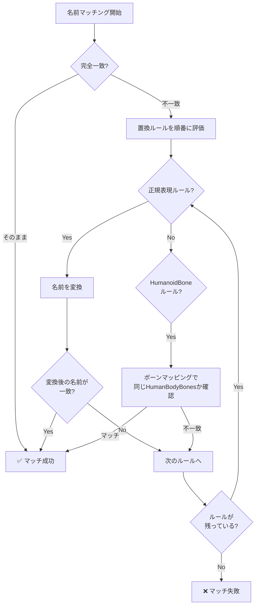
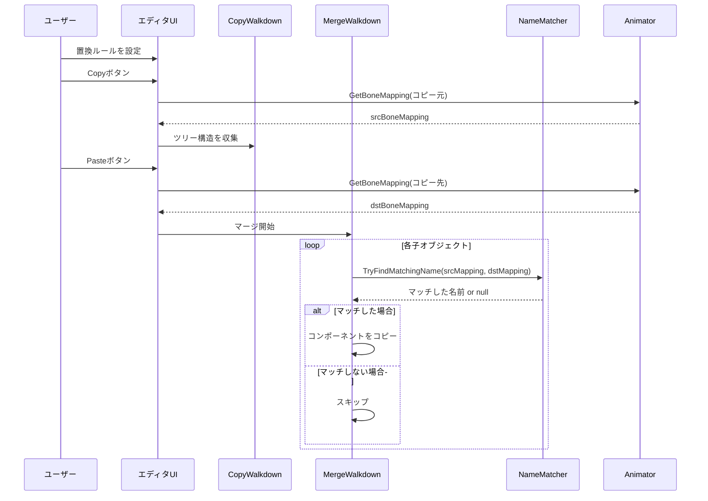

# 置換リスト機能ガイド

このドキュメントでは、コピー時にGameObject名の違いを吸収する「置換リスト」機能について説明します。

## 目次

1. [機能概要](#機能概要)
2. [使用例](#使用例)
3. [ルールタイプ](#ルールタイプ)
4. [HumanoidBoneマッピング](#humanoidboneマッピング)
5. [処理フロー](#処理フロー)

---

## 機能概要

> [!NOTE]
> **ボーン名の命名規則について**
> - `J_Bip_*` は**VRoid Studio**がエクスポート時に使用するボーン命名規則です
> - `mixamorig:*` は**Adobe mixamo**のリグで使用される命名規則です

置換リスト機能は、コピー元とコピー先でGameObjectの名前が異なる場合でも、コンポーネントを正しくコピーできるようにする機能です。

### 問題の背景

異なるツールやフォーマットでエクスポートされたアバターは、ボーン名が異なることがあります：



### 解決策

置換リストを使用して、これらの名前の違いを吸収します：



---

## 使用例

### 例1: VRMアバターからFBXアバターへコピー

VRoid Studio形式のボーン名（`J_Bip_*`）を持つアバターから、標準FBX形式のボーン名を持つアバターへコンポーネントをコピーする場合：



### 例2: 正規表現ルールによる変換

```
検索パターン: J_Bip_C_(.+)
置換パターン: $1
```

| コピー元 | 変換後 | コピー先 | 結果 |
|---------|--------|---------|------|
| J_Bip_C_Head | Head | Head | ✅ マッチ |
| J_Bip_C_Spine | Spine | Spine | ✅ マッチ |
| J_Bip_L_Hand | L_Hand | LeftHand | ❌ 不一致 |

> [!TIP]
> 正規表現ルールだけでは対応できない場合は、HumanoidBoneルールと組み合わせて使用してください。

---

## ルールタイプ

### 正規表現ルール

任意の正規表現パターンで名前を変換します。



**設定例：**

| 検索パターン | 置換パターン | 用途 |
|------------|------------|------|
| `J_Bip_C_(.+)` | `$1` | VRM中央ボーンのプレフィックス削除 |
| `J_Bip_L_(.+)` | `Left$1` | VRM左ボーンを標準形式に変換 |
| `J_Bip_R_(.+)` | `Right$1` | VRM右ボーンを標準形式に変換 |
| `mixamorig:(.+)` | `$1` | mixamoプレフィックス削除 |

### HumanoidBoneルール

Unity Humanoidリグのマッピング情報を使用してマッチングします。



> [!IMPORTANT]
> コピー元・コピー先の両方が**Humanoidリグ**として設定されている必要があります。
> 非Humanoidの場合、警告ダイアログが表示されます。

**動的マッピングの仕組み：**

1. Copyボタン押下時、コピー元のAnimatorからボーンマッピングを取得
2. Pasteボタン押下時、コピー先のAnimatorからボーンマッピングを取得
3. 同じ`HumanBodyBones`にマップされたボーン同士をマッチ

これにより、VRoid Studio形式（`J_Bip_*`）、mixamo形式（`mixamorig:*`）、FBX標準形式など、
異なる命名規則のボーン同士でも、UnityのHumanoidリターゲティング設定が正しければマッチできます。

---

## HumanoidBoneマッピング

### ボーングループ一覧



### ボーングループと含まれるボーン

ボーングループを指定すると、そのグループに属する`HumanBodyBones`のみがマッチ対象になります。

| グループ | 含まれるHumanBodyBones |
|--------|------------------------|
| 頭 | Head, LeftEye, RightEye, Jaw |
| 首 | Neck |
| 胸 | Chest, UpperChest |
| 脊椎 | Spine |
| ヒップ | Hips |
| 左腕 | LeftShoulder, LeftUpperArm, LeftLowerArm, LeftHand |
| 右腕 | RightShoulder, RightUpperArm, RightLowerArm, RightHand |
| 左脚 | LeftUpperLeg, LeftLowerLeg, LeftFoot, LeftToes |
| 右脚 | RightUpperLeg, RightLowerLeg, RightFoot, RightToes |
| 左手指 | 左手の各指のボーン |
| 右手指 | 右手の各指のボーン |

---

## 処理フロー

### 名前マッチングの処理順序



### CopyComponentsByRegexでの使用箇所



---

## 関連ファイル

| ファイル | 説明 |
|---------|------|
| [ReplacementRule.cs](../Editor/ReplacementRule.cs) | 置換ルールのデータ構造 |
| [NameMatcher.cs](../Editor/NameMatcher.cs) | 名前マッチングロジック |
| [CopyComponentsByRegex.cs](../Editor/CopyComponentsByRegex.cs) | メインUIとコピーロジック |

