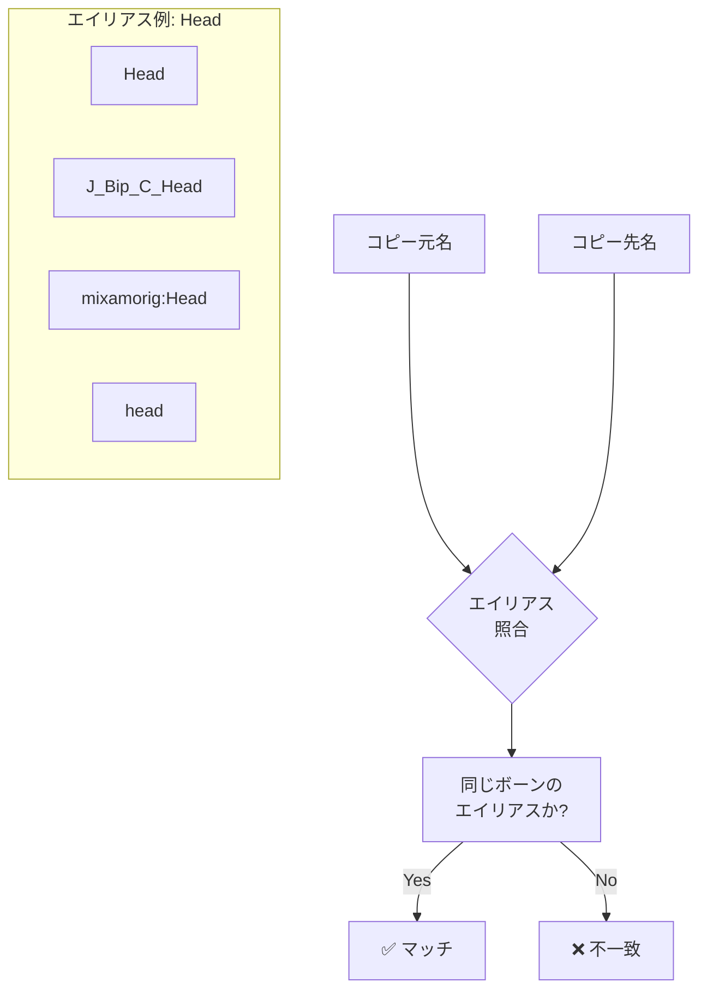
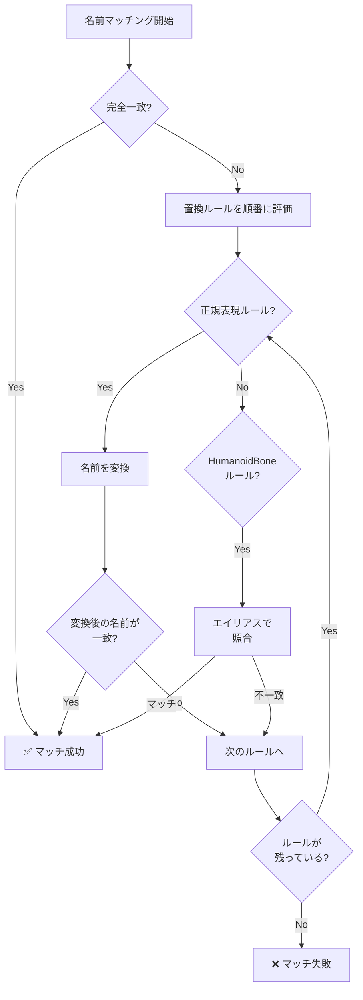
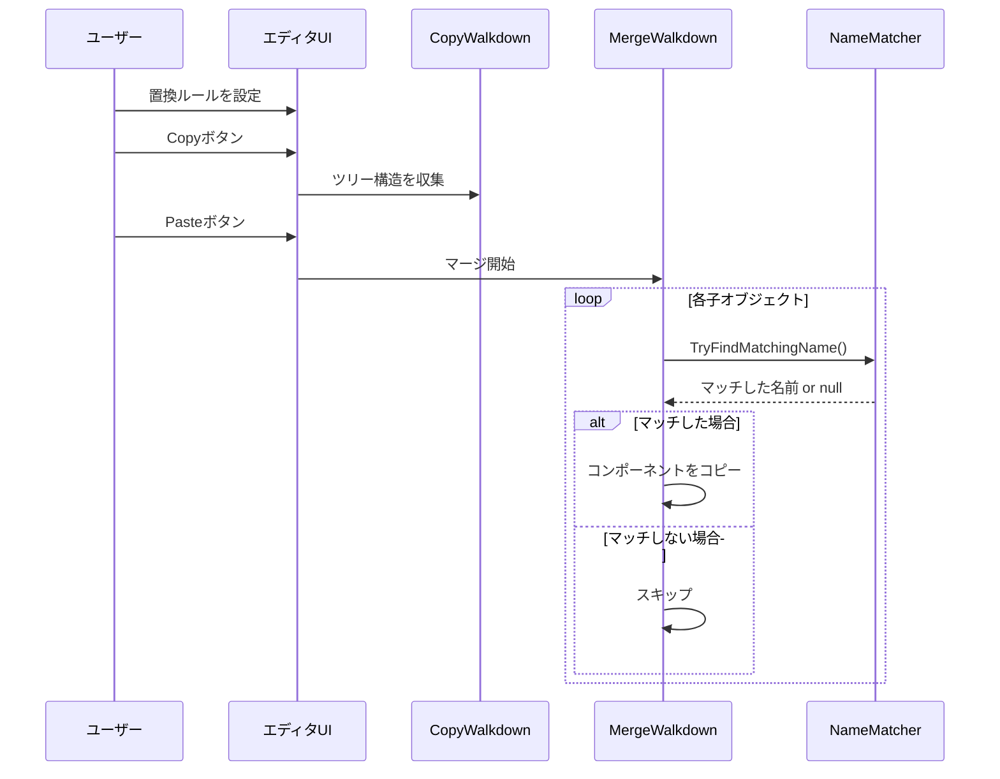

# 置換リスト機能ガイド

このドキュメントでは、コピー時にGameObject名の違いを吸収する「置換リスト」機能について説明します。

## 目次

1. [機能概要](#機能概要)
2. [使用例](#使用例)
3. [ルールタイプ](#ルールタイプ)
4. [HumanoidBoneマッピング](#humanoidboneマッピング)
5. [処理フロー](#処理フロー)

---

## 機能概要

> [!NOTE]
> **ボーン名の命名規則について**
> - `J_Bip_*` は**VRoid Studio**がエクスポート時に使用するボーン命名規則です
> - `mixamorig:*` は**Adobe mixamo**のリグで使用される命名規則です

置換リスト機能は、コピー元とコピー先でGameObjectの名前が異なる場合でも、コンポーネントを正しくコピーできるようにする機能です。

### 問題の背景

異なるツールやフォーマットでエクスポートされたアバターは、ボーン名が異なることがあります：


### 解決策

置換リストを使用して、これらの名前の違いを吸収します：


---

## 使用例

### 例1: VRMアバターからFBXアバターへコピー

VRoid Studio形式のボーン名（`J_Bip_*`）を持つアバターから、標準FBX形式のボーン名を持つアバターへコンポーネントをコピーする場合：


### 例2: 正規表現ルールによる変換

```
検索パターン: J_Bip_C_(.+)
置換パターン: $1
```

| コピー元 | 変換後 | コピー先 | 結果 |
|---------|--------|---------|------|
| J_Bip_C_Head | Head | Head | ✅ マッチ |
| J_Bip_C_Spine | Spine | Spine | ✅ マッチ |
| J_Bip_L_Hand | L_Hand | LeftHand | ❌ 不一致 |

> [!TIP]
> 正規表現ルールだけでは対応できない場合は、HumanoidBoneルールと組み合わせて使用してください。

---

## ルールタイプ

### 正規表現ルール

任意の正規表現パターンで名前を変換します。


**設定例：**

| 検索パターン | 置換パターン | 用途 |
|------------|------------|------|
| `J_Bip_C_(.+)` | `$1` | VRM中央ボーンのプレフィックス削除 |
| `J_Bip_L_(.+)` | `Left$1` | VRM左ボーンを標準形式に変換 |
| `J_Bip_R_(.+)` | `Right$1` | VRM右ボーンを標準形式に変換 |
| `mixamorig:(.+)` | `$1` | mixamoプレフィックス削除 |

### HumanoidBoneルール

Unity Humanoidボーン名のエイリアスを使用してマッチングします。



---

## HumanoidBoneマッピング

### ボーングループ一覧


### 各グループに含まれるボーン

#### 頭グループ
| 標準名 | VRoid Studio形式 | mixamo形式 |
|-------|---------|-----------|
| Head | J_Bip_C_Head | mixamorig:Head |
| LeftEye | J_Adj_L_FaceEye | mixamorig:LeftEye |
| RightEye | J_Adj_R_FaceEye | mixamorig:RightEye |
| Jaw | J_Adj_C_Jaw | - |

#### 左腕グループ
| 標準名 | VRoid Studio形式 | mixamo形式 |
|-------|---------|-----------|
| LeftShoulder | J_Bip_L_Shoulder | mixamorig:LeftShoulder |
| LeftUpperArm | J_Bip_L_UpperArm | mixamorig:LeftArm |
| LeftLowerArm | J_Bip_L_LowerArm | mixamorig:LeftForeArm |
| LeftHand | J_Bip_L_Hand | mixamorig:LeftHand |

---

## 処理フロー

### 名前マッチングの処理順序



### CopyComponentsByRegexでの使用箇所



---

## 関連ファイル

| ファイル | 説明 |
|---------|------|
| [ReplacementRule.cs](../Editor/ReplacementRule.cs) | 置換ルールのデータ構造 |
| [NameMatcher.cs](../Editor/NameMatcher.cs) | 名前マッチングロジック |
| [CopyComponentsByRegex.cs](../Editor/CopyComponentsByRegex.cs) | メインUIとコピーロジック |

