# 置換リスト機能ガイド

このドキュメントでは、コピー時にGameObject名の違いを吸収する「置換リスト」機能について説明します。

## 目次

1. [機能概要](#機能概要)
2. [使用例](#使用例)
3. [ルールタイプ](#ルールタイプ)
4. [HumanoidBoneマッピング](#humanoidboneマッピング)
5. [処理フロー](#処理フロー)

---

## 機能概要

> [!NOTE]
> **ボーン名の命名規則について**
> - `J_Bip_*` は**VRoid Studio**がエクスポート時に使用するボーン命名規則です
> - `mixamorig:*` は**Adobe mixamo**のリグで使用される命名規則です

置換リスト機能は、コピー元とコピー先でGameObjectの名前が異なる場合でも、コンポーネントを正しくコピーできるようにする機能です。

### 問題の背景

異なるツールやフォーマットでエクスポートされたアバターは、ボーン名が異なることがあります：

```mermaid
graph LR
    subgraph "VRoid Studio形式"
        A1["J_Bip_C_Hips"]
        A2["J_Bip_C_Head"]
        A3["J_Bip_L_UpperArm"]
    end
    subgraph "FBX標準形式"
        B1["Hips"]
        B2["Head"]
        B3["LeftUpperArm"]
    end
    subgraph "mixamo形式"
        C1["mixamorig:Hips"]
        C2["mixamorig:Head"]
        C3["mixamorig:LeftArm"]
    end
```



### 解決策

置換リストを使用して、これらの名前の違いを吸収します：

```mermaid
flowchart TD
    A["コピー元\nJ_Bip_C_Head"] -->|"置換ルール適用"| B{"名前マッチング"}
    C["コピー先\nHead"] --> B
    B -->|"マッチ成功"| D["コンポーネントをコピー"]
    B -->|"マッチ失敗"| E["スキップ"]
```



---

## 使用例

### 例1: VRMアバターからFBXアバターへコピー

VRoid Studio形式のボーン名（`J_Bip_*`）を持つアバターから、標準FBX形式のボーン名を持つアバターへコンポーネントをコピーする場合：

```mermaid
graph TB
    subgraph "コピー元: VRMアバター"
        direction TB
        S1["Root"]
        S2["J_Bip_C_Hips"]
        S3["J_Bip_C_Spine"]
        S4["J_Bip_C_Chest"]
        S5["J_Bip_C_Head\n📦 DynamicBone"]
        S1 --> S2 --> S3 --> S4 --> S5
    end
    
    subgraph "コピー先: FBXアバター"
        direction TB
        D1["Armature"]
        D2["Hips"]
        D3["Spine"]
        D4["Chest"]
        D5["Head\n✅ DynamicBone"]
        D1 --> D2 --> D3 --> D4 --> D5
    end
    
    S5 -.->|"HumanoidBoneルール\n(頭)"| D5
```



### 例2: 正規表現ルールによる変換

```
検索パターン: J_Bip_C_(.+)
置換パターン: $1
```

| コピー元 | 変換後 | コピー先 | 結果 |
|---------|--------|---------|------|
| J_Bip_C_Head | Head | Head | ✅ マッチ |
| J_Bip_C_Spine | Spine | Spine | ✅ マッチ |
| J_Bip_L_Hand | L_Hand | LeftHand | ❌ 不一致 |

> [!TIP]
> 正規表現ルールだけでは対応できない場合は、HumanoidBoneルールと組み合わせて使用してください。

---

## ルールタイプ

### 正規表現ルール

任意の正規表現パターンで名前を変換します。

```mermaid
flowchart LR
    A["入力名\nJ_Bip_C_Head"] --> B["正規表現\nJ_Bip_C_(.+)"]
    B --> C["置換\n$1"]
    C --> D["出力名\nHead"]
```



**設定例：**

| 検索パターン | 置換パターン | 用途 |
|------------|------------|------|
| `J_Bip_C_(.+)` | `$1` | VRM中央ボーンのプレフィックス削除 |
| `J_Bip_L_(.+)` | `Left$1` | VRM左ボーンを標準形式に変換 |
| `J_Bip_R_(.+)` | `Right$1` | VRM右ボーンを標準形式に変換 |
| `mixamorig:(.+)` | `$1` | mixamoプレフィックス削除 |

### HumanoidBoneルール

Unity Humanoidボーン名のエイリアスを使用してマッチングします。

```mermaid
flowchart TD
    A["コピー元名"] --> B{"エイリアス\n照合"}
    C["コピー先名"] --> B
    
    B --> D["同じボーンの\nエイリアスか?"]
    D -->|"Yes"| E["✅ マッチ"]
    D -->|"No"| F["❌ 不一致"]
    
    subgraph "エイリアス例: Head"
        G["Head"]
        H["J_Bip_C_Head"]
        I["mixamorig:Head"]
        J["head"]
    end
```



---

## HumanoidBoneマッピング

### ボーングループ一覧

```mermaid
graph TD
    subgraph "全身"
        ALL["すべて"]
    end
    
    subgraph "体幹"
        HIPS["ヒップ"]
        SPINE["脊椎"]
        CHEST["胸"]
        NECK["首"]
        HEAD["頭"]
    end
    
    subgraph "腕"
        LARM["左腕"]
        RARM["右腕"]
    end
    
    subgraph "脚"
        LLEG["左脚"]
        RLEG["右脚"]
    end
    
    subgraph "指"
        LFINGER["左手指"]
        RFINGER["右手指"]
    end
    
    ALL --> HIPS & SPINE & CHEST & NECK & HEAD
    ALL --> LARM & RARM
    ALL --> LLEG & RLEG
    ALL --> LFINGER & RFINGER
```



### 各グループに含まれるボーン

#### 頭グループ
| 標準名 | VRoid Studio形式 | mixamo形式 |
|-------|---------|-----------|
| Head | J_Bip_C_Head | mixamorig:Head |
| LeftEye | J_Adj_L_FaceEye | mixamorig:LeftEye |
| RightEye | J_Adj_R_FaceEye | mixamorig:RightEye |
| Jaw | J_Adj_C_Jaw | - |

#### 左腕グループ
| 標準名 | VRoid Studio形式 | mixamo形式 |
|-------|---------|-----------|
| LeftShoulder | J_Bip_L_Shoulder | mixamorig:LeftShoulder |
| LeftUpperArm | J_Bip_L_UpperArm | mixamorig:LeftArm |
| LeftLowerArm | J_Bip_L_LowerArm | mixamorig:LeftForeArm |
| LeftHand | J_Bip_L_Hand | mixamorig:LeftHand |

---

## 処理フロー

### 名前マッチングの処理順序

```mermaid
flowchart TD
    START["名前マッチング開始"] --> A{"完全一致?"}
    A -->|"Yes"| SUCCESS["✅ マッチ成功"]
    A -->|"No"| B["置換ルールを順番に評価"]
    
    B --> C{"正規表現ルール?"}
    C -->|"Yes"| D["名前を変換"]
    D --> E{"変換後の名前が\n一致?"}
    E -->|"Yes"| SUCCESS
    E -->|"No"| F["次のルールへ"]
    
    C -->|"No"| G{"HumanoidBone\nルール?"}
    G -->|"Yes"| H["エイリアスで\n照合"]
    H -->|"マッチ"| SUCCESS
    H -->|"不一致"| F
    
    F --> I{"ルールが\n残っている?"}
    I -->|"Yes"| C
    I -->|"No"| FAIL["❌ マッチ失敗"]
```



### CopyComponentsByRegexでの使用箇所

```mermaid
sequenceDiagram
    participant User as ユーザー
    participant UI as エディタUI
    participant Copy as CopyWalkdown
    participant Merge as MergeWalkdown
    participant NM as NameMatcher

    User->>UI: 置換ルールを設定
    User->>UI: Copyボタン
    UI->>Copy: ツリー構造を収集
    
    User->>UI: Pasteボタン
    UI->>Merge: マージ開始
    
    loop 各子オブジェクト
        Merge->>NM: TryFindMatchingName()
        NM-->>Merge: マッチした名前 or null
        alt マッチした場合
            Merge->>Merge: コンポーネントをコピー
        else マッチしない場合
            Merge->>Merge: スキップ
        end
    end
```



---

## 関連ファイル

| ファイル | 説明 |
|---------|------|
| [ReplacementRule.cs](../Editor/ReplacementRule.cs) | 置換ルールのデータ構造 |
| [NameMatcher.cs](../Editor/NameMatcher.cs) | 名前マッチングロジック |
| [CopyComponentsByRegex.cs](../Editor/CopyComponentsByRegex.cs) | メインUIとコピーロジック |

